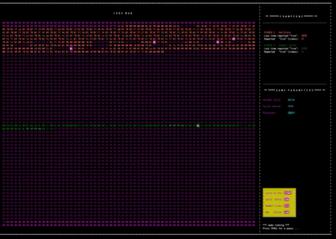

# Corewar
Core War was inspired by a malicious virus written in the 80’s. To deal with the self-replicating virus, a white hat hacker invented Reaper. It was a virus designed to spread and eliminate the malware. He fought fire with fire.

This inspired A. K. Dewdney to coin the idea for Core War.

The idea was simple. You compete by designing viruses to overtake a computer. You win by protecting your own program and overwriting your opponent's programs. This is all happening on a virtual computer. Think, a simple computer within your computer.

This is what is looks like in action: 

# Getting Started
Clone and Make:
git clone https://github.com/AidanSully/Corewar/ && Corewar && make && make clean

Launch program without params to get help:

./corewar [-dump nbr_cycles] [[-n number] champion1.cor] [champion2.cor] [champion3.cor] ...
-dump <num> : Dump memory (32 octets per line) after <num> cycles and exit
-v : Run visualizer
-n <num> : Set <num> of the next player
Example:
./corewar -v champions/bee_gees.cor champions/zork.cor champions/bigzork.cor champions/helltrain.cor

You can use champions with extantion .cor from champions folder. Or you free to write your own champions and run them on this Virtual Machine. To write champion you need to use pseudo assambly programming lanquage which has name Redcode. Than compile this Redcode warrior to binary with extention .cor.
